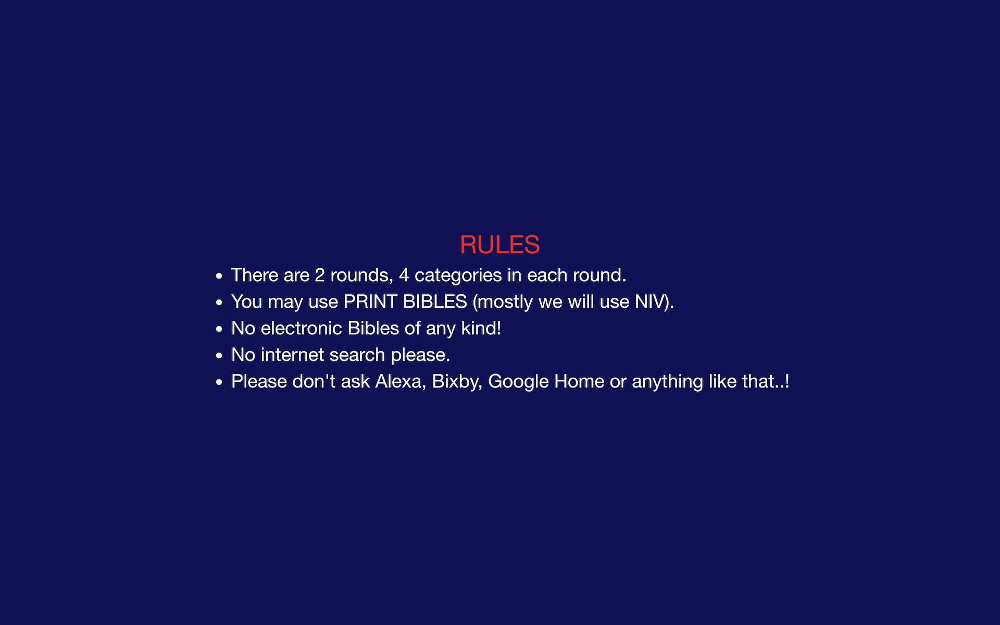
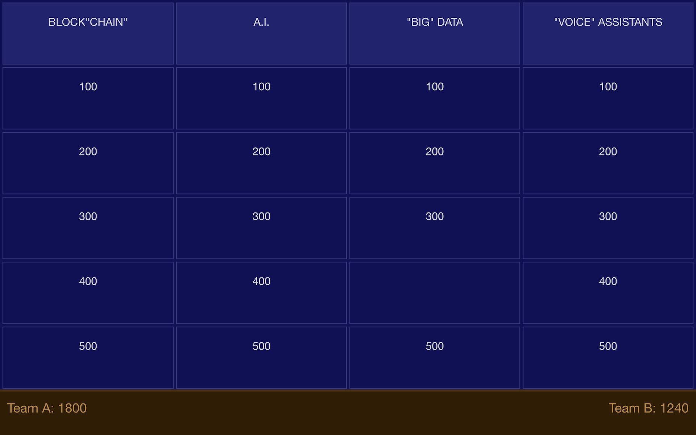
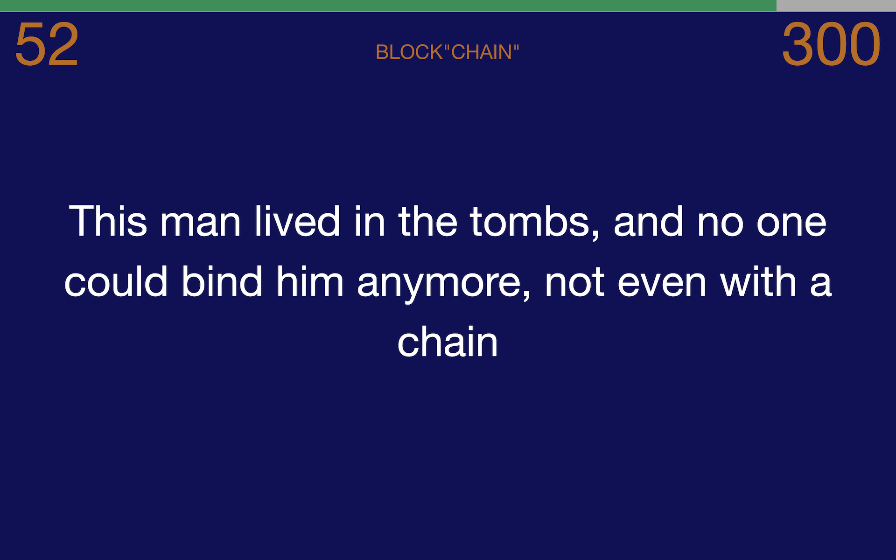
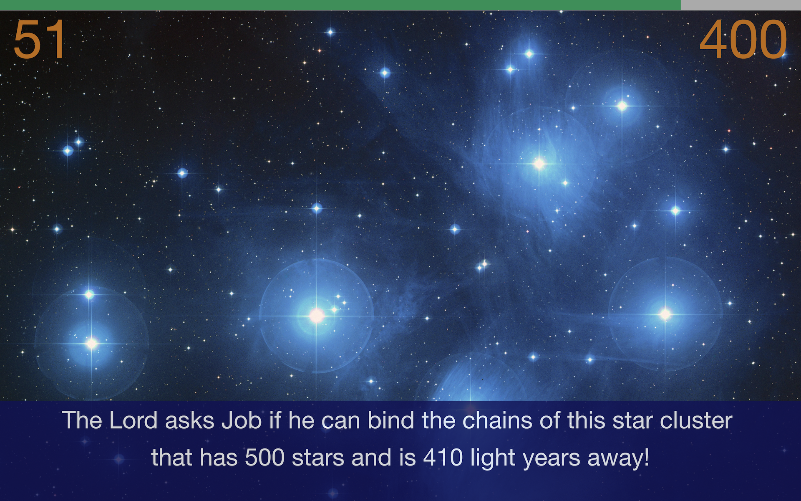
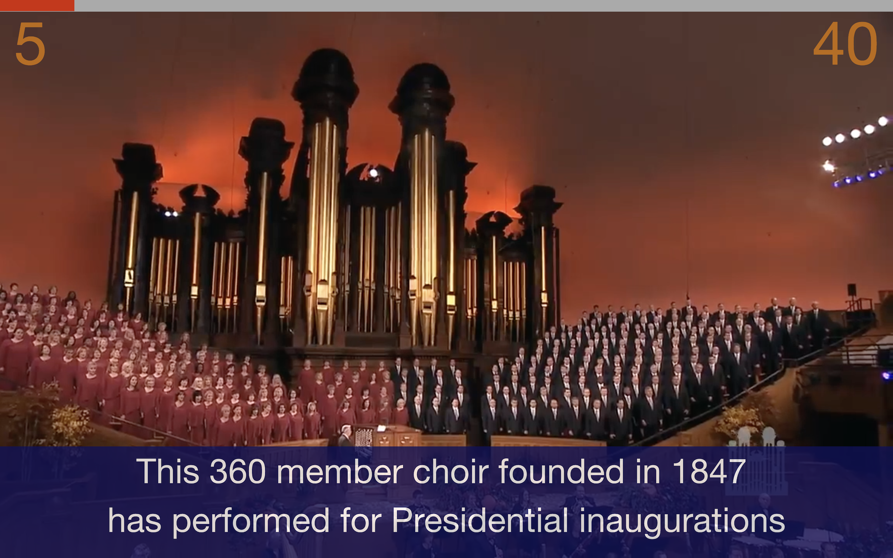
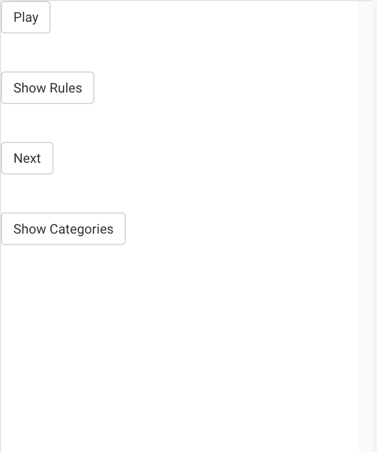
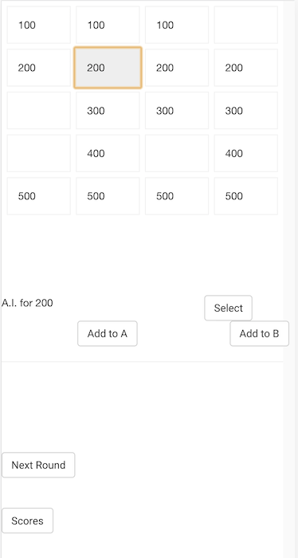
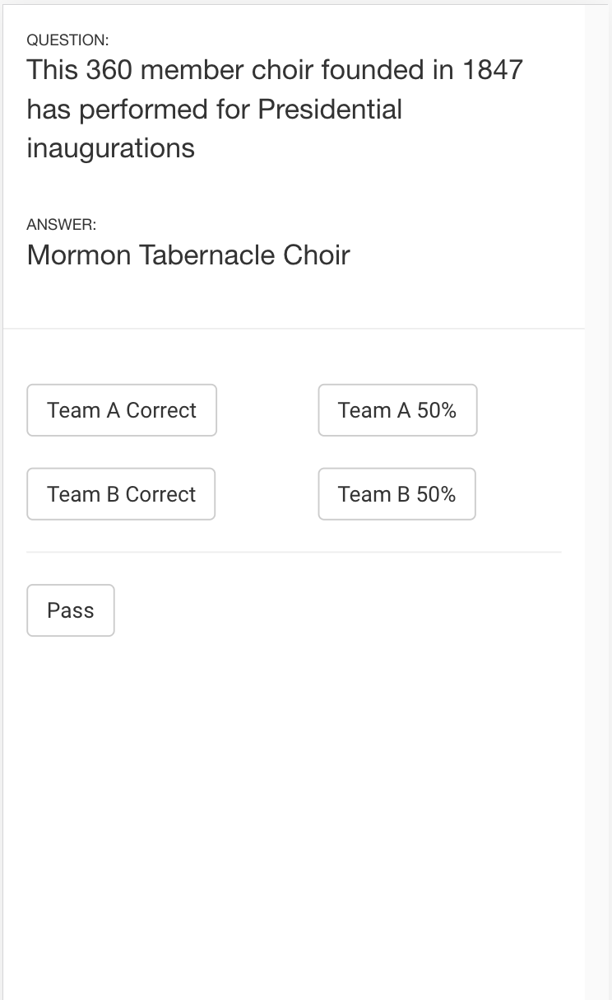

# berea
Bible Jeopardy

> The people of **Berea** were more open-minded than the people of Thessalonica. They were very willing to receive God's message, and every day they **carefully examined the Scriptures** to see if what Paul said was true. - Acts 17:11 

This is an adaptation of the famous TV show Jeopardy!, to be played in a small group setting.

I first coded this in Java, to be used in a small Bible group in San Diego between 2001-2005. 
The new version is completely rebuilt in JavaScript / node.js.

## Installation

You need to have node.js / npm / bower installed on your computer. 

#### 1. Install npm packages (server side dependencies)
`npm install`

#### 2. Install bower packages (client side dependencies)
`bower install`

#### 3. Install gulp (if you don't have already)

https://gulpjs.com/docs/en/getting-started/quick-start

#### 4. Start server

`gulp server`

## Running a Quiz Program
Once the server is started, you are set to run a quiz show. Everything is browser based. 
There are two screens:
- A **show screen** visible to the audience, and most likely projected on to a big screen.
- A **controller screen** visible only to the quiz master.

The show screen should be a browser window in full screen mode 
(could be running on the same computer as the server), and the controller 
screen should be a browser, preferably on a handheld device. Both devices should be on the
**same** network.

The show screen is initialized using this URL

`http://localhost:8080/game/init`

The controller screen is initialized using this URL

`http://localhost:8080/ctrl/init`

Replace localhost with the IP of the server on the controller screen.

## Show Screens

#### Opening Screen

#### Rules Screen

#### Showing Categories

#### Game Board

#### A Clue

#### A Picture Clue

#### A Video Clue

## Control Screens
I know these screens are really ugly, but I programmed it just the day before the retreat, 
and was focusing more on being functional and fail-proof (plus only I can see them :)). 
I will make these better as I find time :)

#### Init Screen

#### Board Screen

#### Clue Screen

## Preparing a Quiz

#### Game Definition File
The quiz program is controlled by a simple JSON file. It is currently hardcoded in `data/cci2018/game.json`.
Modify that file to create your own quiz game.

#### Game State File
After every action, the program saves the game state. In case of a crash/power outage etc.,
re-starting the program will cause it to start from where it was left off. This game state is 
stored in the file `data/game-state.json`.

*Important:* If you don't want to resume from last game, please delete the game state file before starting the show.